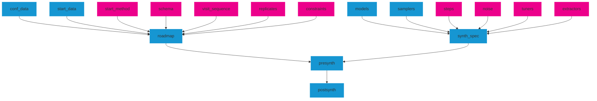

# tidysynthesis <a href="https://dplyr.tidyverse.org"></a>

This repository contains the tidysynthesis R package for generating
synthetic data. Complete documentation is available is available at the
[tidysynthesis documentation
website](https://ui-research.github.io/tidysynthesis-documentation/).

## Installation:

``` r
# The easiest way to get tidysynthesis is from CRAN:
install.packages("tidysynthesis")

# Or the development version from GitHub:
# install.packages("pak")
pak::pak("UrbanInstitute/tidysynthesis")
```

## Overview

`tidysynthesis` is a “metapackage” for creating synthetic data sets for
statistical disclosure limitation that shares the underlying design
philosophy, grammar, and data structures of the
[tidyverse](https://tidyverse.org/) and
[tidymodels](https://www.tidymodels.org/). `tidysynthesis` flexibly
supports sequential synthesis modeling and sampling specifications with
different formal and empirical privacy properties.

Note that the privacy and security properties of tidysynthesis’s outputs
rely on many different technical assumptions. Our goal is to make the
package agnostic to many of these assumptions, which places greater
responsibility on users to evaluate synthetic data prior to
dissemination. For more information, see our notes on [security
principles](https://ui-research.github.io/tidysynthesis-documentation/security-principles.html)
from our documentation.

### `presynth`

Syntheses ultimately depend on a `presynth` object with two main
components: a `roadmap` that outlines the macroscopic workflow (i.e.,
what order to synthesize variables, how variables are defined and relate
to one another, etc.) and a `synth_spec` that details how individual
variables are synthesized (i.e. how are specific output variable
modeling workflows specified, how are new synthetic samples generated,
etc.). Here is the general workflow, with required objects in blue and
optional objects in magenta.



### `roadmap` Components

`roadmap` objects require data inputs. All other inputs can be
optionally supplied as S3 objects or constructed by default. `roadmap`s
also have a `tidymodels`-style API that lets you update objects, for
example:

``` r
# create an example roadmap
roadmap(conf_data = example_conf_data, 
        start_data = example_start_data) %>%
  # add an example visit_sequence using the API
  add_sequence_manual(var1, var2) %>%
  # update the example schema using the API
  update_schema(col_schema = list("var1" = list("dtype" = "fct")))
```

See the documentation website for more API examples.

Required `roadmap` objects:

- `conf_data`: the `data.frame` of confidential data to synthesize.
- `start_data` the `data.frame` of starting data to initialize
  sequential models.

Optional `roadmap` objects:

- `start_method()`: S3 object that specifies randomized transformations
  on the `start_data`, such as resampling, noise infusion, or joint
  modeling. Defaults to no transformation.
- `schema()`: S3 column schema with specifications describing variables,
  such as data types and `NA` values. Defaults to inferred types from
  the provided `conf_data`.
- `visit_sequence()`: S3 object that specifies the order in which
  variables get synthesized. Defaults to the same order they appear in
  the confidential data.
- `contraints()`: S3 object that controls imposed constraints during the
  synthesis process, such as maxima and minima for numeric variables.
  Defaults to no constraints.
- `replicates()`: S3 object controlling the synthesis component
  repetition for producing multiple synthetic datasets. Defaults to one
  synthetic dataset.

### `synth_spec` Components

`synth_spec` S3 objects allow you to specify different components using
default versions for regression and classification models, or custom
models mapping individual variables to components. Here is an example:

``` r
synth_spec(
  default_regression_sampler = tidysynthesis::sample_lm,
  default_classification_sampler = tidysynthesis::sample_rpart,
  custom_samplers = list(
    list("vars" = c("var1", "var2"), "sampler" = sample_ranger)
  ),
  ...
)
```

These components also support updating via a `tidymodels`-style API; see
the documentation website for more API examples.

Required `synth_spec` components:

- `models`: `parsnip` model specifications
- `samplers`: sampler functions (many provided in `tidysynthesis`)

Optional `synth_spec` components:

- `steps`: functions that transform predictors using `recipe::steps_*`
  functions.
- `noise`: S3 object for specifying additive noise for synthesis
  outputs.
- `tuners`: list specifications for cross-validating hyperparameter
  tuning
- `extractors`: `parsnip` functions for extracting fit model
  information.

## Examples

Code in the following set of examples synthesizes the palmerpenguins
data set with missing values removed.

``` r
library(palmerpenguins)
library(tidyverse)
library(tidysynthesis)

penguins_complete <- penguins %>%
  select(-year) %>%
  filter(complete.cases(.)) %>%
  mutate(
    flipper_length_mm = as.numeric(flipper_length_mm),
    body_mass_g = as.numeric(body_mass_g)
  )
```

All of the examples use the same starting data and visit sequence, as
specified by the roadmap below.

``` r
set.seed(20220218)

# create "starting data"
starting_data <- penguins_complete %>% 
  group_by(island) %>%
  slice_sample(n = 5) %>%
  select(species, island, sex) %>%
  ungroup()

# create roadmap
roadmap <- roadmap(
  conf_data = penguins_complete,
  start_data = starting_data
) %>% 
  add_sequence_numeric(
    dplyr::where(is.numeric), 
    method = "correlation", 
    cor_var = "bill_length_mm"
  )
```

## Example 1

Example 1 uses linear regression to synthesize the numeric data in the
penguins data set. `sample_lm()` samples from normal distributions
centered on the regression line with standard deviation equal to the
residual standard error.

``` r
# synth_spec

lm_mod <- parsnip::linear_reg() %>% 
  parsnip::set_engine(engine = "lm") %>%
  parsnip::set_mode(mode = "regression")

synth_spec1 <- synth_spec(
  default_regression_model = lm_mod,
  default_regression_sampler = tidysynthesis::sample_lm
)

# create a presynth object
# use defaults for noise, constraints, and replicates
presynth1 <- presynth(
  roadmap = roadmap,
  synth_spec = synth_spec1
)

# synthesize!
set.seed(1)
postsynth1 <- synthesize(presynth = presynth1)
```

    #> Synthesizing 1/4 bill_length_mm...

    #> Synthesizing 2/4 flipper_length_mm...

    #> Synthesizing 3/4 body_mass_g...

    #> Synthesizing 4/4 bill_depth_mm...

``` r
postsynth1$synthetic_data
```

    #> # A tibble: 15 × 7
    #>    species   island    sex    bill_length_mm flipper_length_mm body_mass_g
    #>    <fct>     <fct>     <fct>           <dbl>             <dbl>       <dbl>
    #>  1 Gentoo    Biscoe    male             47.9              219.       5764.
    #>  2 Gentoo    Biscoe    male             49.8              221.       5400.
    #>  3 Gentoo    Biscoe    female           43.7              218.       4895.
    #>  4 Gentoo    Biscoe    male             53.1              227.       5605.
    #>  5 Gentoo    Biscoe    female           46.4              217.       4432.
    #>  6 Chinstrap Dream     female           45.1              196.       3308.
    #>  7 Chinstrap Dream     female           48.1              197.       3399.
    #>  8 Adelie    Dream     male             42.1              195.       4075.
    #>  9 Chinstrap Dream     female           48.3              182.       3565.
    #> 10 Adelie    Dream     female           35.9              189.       3624.
    #> 11 Adelie    Torgersen male             44.4              197.       4110.
    #> 12 Adelie    Torgersen female           38.1              188.       3322.
    #> 13 Adelie    Torgersen female           35.8              179.       3391.
    #> 14 Adelie    Torgersen male             35.8              189.       3997.
    #> 15 Adelie    Torgersen female           39.8              192.       3307.
    #> # ℹ 1 more variable: bill_depth_mm <dbl>

## Example 2

`synth_spec()` can accept different model types. The example below is a
regression tree model. Notice how all of the other objects from example
1 can be reused.

``` r
dt_mod <- parsnip::decision_tree() %>%
  parsnip::set_engine(engine = "rpart") %>%
  parsnip::set_mode(mode = "regression")

synth_spec2 <- synth_spec(
  default_regression_model = dt_mod,
  default_regression_sampler = tidysynthesis::sample_rpart
)

# create a presynth object
presynth2 <- presynth(
  roadmap = roadmap,
  synth_spec = synth_spec2
)

# synthesize!
set.seed(1)
postsynth2 <- synthesize(presynth = presynth2)
```

    #> Synthesizing 1/4 bill_length_mm...

    #> Synthesizing 2/4 flipper_length_mm...

    #> Synthesizing 3/4 body_mass_g...

    #> Synthesizing 4/4 bill_depth_mm...

``` r
postsynth2$synthetic_data
```

    #> # A tibble: 15 × 7
    #>    species   island    sex    bill_length_mm flipper_length_mm body_mass_g
    #>    <fct>     <fct>     <fct>           <dbl>             <dbl>       <dbl>
    #>  1 Gentoo    Biscoe    male             49.6               220        5350
    #>  2 Gentoo    Biscoe    male             50                 215        5550
    #>  3 Gentoo    Biscoe    female           45.2               222        4700
    #>  4 Gentoo    Biscoe    male             59.6               216        5500
    #>  5 Gentoo    Biscoe    female           42.8               218        5000
    #>  6 Chinstrap Dream     female           46.6               195        3550
    #>  7 Chinstrap Dream     female           40.9               185        3700
    #>  8 Adelie    Dream     male             39.2               186        3800
    #>  9 Chinstrap Dream     female           47.7               190        2900
    #> 10 Adelie    Dream     female           36                 176        3850
    #> 11 Adelie    Torgersen male             41.4               178        4050
    #> 12 Adelie    Torgersen female           37                 174        3350
    #> 13 Adelie    Torgersen female           37                 180        3775
    #> 14 Adelie    Torgersen male             41.6               195        3550
    #> 15 Adelie    Torgersen female           36.8               191        3200
    #> # ℹ 1 more variable: bill_depth_mm <dbl>

## Example 3

Sometimes prediction error is not enough and additional noise is added
to predictions. `noise` controls adding additional noise to predicted
values. `add_noise` toggles on/off which variables will receive
additional noise. Here, we use the function `add_noise_kde()` with
additional arguments `exclusions` and `n_ntiles` passed to this function
(see the documentation `?add_noise_kde` for details.)

``` r
# noise
# this turns on noise for all variables and adds 0 as an exclusion for body_mass_g
noise_spec <- noise(
  add_noise = TRUE,
  noise_func = add_noise_kde,
  exclusions = 0,
  n_ntiles = 20
)

synth_spec3 <- synth_spec2 %>%
  update_synth_spec(
    default_regression_noise = noise_spec
  )

presynth3 <- presynth(
  roadmap = roadmap,
  synth_spec = synth_spec3
)

# synthesize!
set.seed(1)
postsynth3 <- synthesize(presynth = presynth3)
```

    #> Synthesizing 1/4 bill_length_mm...

    #> Synthesizing 2/4 flipper_length_mm...

    #> Synthesizing 3/4 body_mass_g...

    #> Synthesizing 4/4 bill_depth_mm...

``` r
postsynth3$synthetic_data
```

    #> # A tibble: 15 × 7
    #>    species   island    sex    bill_length_mm flipper_length_mm body_mass_g
    #>    <fct>     <fct>     <fct>           <dbl>             <dbl>       <dbl>
    #>  1 Gentoo    Biscoe    male             49.5              217.       5283.
    #>  2 Gentoo    Biscoe    male             49.8              218.       5254.
    #>  3 Gentoo    Biscoe    female           45.1              208.       4420.
    #>  4 Gentoo    Biscoe    male             59.9              215.       5881.
    #>  5 Gentoo    Biscoe    female           42.4              210.       4467.
    #>  6 Chinstrap Dream     female           47.4              195.       3321.
    #>  7 Chinstrap Dream     female           41.0              208.       3289.
    #>  8 Adelie    Dream     male             39.9              195.       3914.
    #>  9 Chinstrap Dream     female           47.4              198.       3463.
    #> 10 Adelie    Dream     female           36.5              184.       3072.
    #> 11 Adelie    Torgersen male             40.8              199.       3548.
    #> 12 Adelie    Torgersen female           37.6              196.       3841.
    #> 13 Adelie    Torgersen female           37.3              170.       3582.
    #> 14 Adelie    Torgersen male             41.4              189.       3461.
    #> 15 Adelie    Torgersen female           37.7              182.       3400.
    #> # ℹ 1 more variable: bill_depth_mm <dbl>

## Example 4

`tidysynthesis` contains a system for specifying constraints during this
synthesis process. This means constraints imposed on earlier variables
are realized before later variables are synthesized. The constraints can
be unconditional (e.g. penguin weight must be positive) or conditional
(e.g. a Gentoo penguin must weigh at least 6,000 grams).

Constraints can be specified for numeric and/or categorical variables.
Depending on the variable type, two different `constraint_df_*` can be
specified, either `constraints_df_num` or `constraints_df_cat` (see the
documentation `?constraints` for examples.) `max_z_num` and `max_z_cat`
controls the number of times a value should be resampled if it violates
a constraint before enforcing the constraints by modifying synthesized
values.

Below is an example using `constraints_df_num` and `max_df_num`.

``` r
# create a tibble of constraints
# skipped variables will have a minimum of -Inf and a maximum of Inf
constraints_df_num <- 
  tibble::tribble(
    ~var, ~min, ~max, ~conditions,
    "bill_length_mm", 0, Inf, "TRUE",
    "bill_length_mm", 0, Inf, "TRUE",
    "flipper_length_mm", 0, Inf, "TRUE",
    "body_mass_g", 0, Inf, "TRUE",
    "body_mass_g", 4000, 10000, "flipper_length_mm > 190",
    "body_mass_g", 6000, Inf, "species == 'Gentoo'"
  ) 

# create a constraints object
constraints4 <- constraints(
  schema = roadmap$schema,
  constraints_df_num = constraints_df_num,
  max_z_num = list(0, 1, 2, 3)
)

presynth4 <- presynth(
  roadmap = roadmap %>%
    add_constraints(constraints4),
  synth_spec = synth_spec3
)

# synthesize!
set.seed(1)
postsynth4 <- synthesize(presynth = presynth4)
```

    #> Synthesizing 1/4 bill_length_mm...

    #> Synthesizing 2/4 flipper_length_mm...

    #> Synthesizing 3/4 body_mass_g...

    #> Synthesizing 4/4 bill_depth_mm...

``` r
postsynth4$synthetic_data
```

    #> # A tibble: 15 × 7
    #>    species   island    sex    bill_length_mm flipper_length_mm body_mass_g
    #>    <fct>     <fct>     <fct>           <dbl>             <dbl>       <dbl>
    #>  1 Gentoo    Biscoe    male             49.5              217.       6001.
    #>  2 Gentoo    Biscoe    male             49.8              218.       6309.
    #>  3 Gentoo    Biscoe    female           45.1              208.       6000 
    #>  4 Gentoo    Biscoe    male             59.9              215.       6000 
    #>  5 Gentoo    Biscoe    female           42.4              210.       6000 
    #>  6 Chinstrap Dream     female           47.4              195.       4000 
    #>  7 Chinstrap Dream     female           41.0              208.       4000 
    #>  8 Adelie    Dream     male             39.9              195.       4000 
    #>  9 Chinstrap Dream     female           47.4              198.       4000 
    #> 10 Adelie    Dream     female           36.5              184.       3072.
    #> 11 Adelie    Torgersen male             40.8              199.       4000 
    #> 12 Adelie    Torgersen female           37.6              196.       4000 
    #> 13 Adelie    Torgersen female           37.3              170.       3582.
    #> 14 Adelie    Torgersen male             41.4              189.       3461.
    #> 15 Adelie    Torgersen female           37.7              182.       3400.
    #> # ℹ 1 more variable: bill_depth_mm <dbl>

## Example 5

`tidysynthesis` can generate multiple replicates. This means that all
input conditions are the same, but, due to random sampling, the
syntheses themselves differ. The `replicates()` functionality allows for
the creation of these replicates (see the documentation `?replicates()`
for different kinds of replicate specification).

``` r
replicates5 <- replicates(model_sample_replicates = 5)

presynth5 <- presynth(
  roadmap = roadmap %>%
    add_replicates(replicates5),
  synth_spec = synth_spec2
)

# synthesize!
set.seed(1)
suppressMessages(synth5 <- synthesize(presynth = presynth5))

glimpse(synth5[[1]]$synthetic_data)
```

    #> Rows: 15
    #> Columns: 7
    #> $ species           <fct> Gentoo, Gentoo, Gentoo, Gentoo, Gentoo, Chinstrap, C…
    #> $ island            <fct> Biscoe, Biscoe, Biscoe, Biscoe, Biscoe, Dream, Dream…
    #> $ sex               <fct> male, male, female, male, female, female, female, ma…
    #> $ bill_length_mm    <dbl> 49.6, 50.0, 45.2, 59.6, 42.8, 46.6, 40.9, 39.2, 47.7…
    #> $ flipper_length_mm <dbl> 220, 215, 222, 216, 218, 195, 185, 186, 190, 176, 17…
    #> $ body_mass_g       <dbl> 5350, 5550, 4700, 5500, 5000, 3550, 3700, 3800, 2900…
    #> $ bill_depth_mm     <dbl> 15.3, 15.9, 14.5, 15.9, 13.7, 18.0, 16.6, 17.2, 18.7…

``` r
glimpse(synth5[[2]]$synthetic_data)
```

    #> Rows: 15
    #> Columns: 7
    #> $ species           <fct> Gentoo, Gentoo, Gentoo, Gentoo, Gentoo, Chinstrap, C…
    #> $ island            <fct> Biscoe, Biscoe, Biscoe, Biscoe, Biscoe, Dream, Dream…
    #> $ sex               <fct> male, male, female, male, female, female, female, ma…
    #> $ bill_length_mm    <dbl> 50.4, 51.4, 44.9, 51.9, 47.5, 46.5, 48.4, 37.6, 50.1…
    #> $ flipper_length_mm <dbl> 228, 220, 208, 230, 209, 189, 198, 187, 202, 190, 18…
    #> $ body_mass_g       <dbl> 6000, 5550, 4850, 5700, 5200, 3200, 3500, 4500, 3700…
    #> $ bill_depth_mm     <dbl> 16.4, 15.7, 13.8, 15.3, 14.3, 19.4, 16.8, 19.5, 17.3…

``` r
glimpse(synth5[[3]]$synthetic_data)
```

    #> Rows: 15
    #> Columns: 7
    #> $ species           <fct> Gentoo, Gentoo, Gentoo, Gentoo, Gentoo, Chinstrap, C…
    #> $ island            <fct> Biscoe, Biscoe, Biscoe, Biscoe, Biscoe, Dream, Dream…
    #> $ sex               <fct> male, male, female, male, female, female, female, ma…
    #> $ bill_length_mm    <dbl> 51.3, 48.5, 46.0, 50.0, 48.1, 45.2, 46.4, 41.4, 45.7…
    #> $ flipper_length_mm <dbl> 220, 225, 210, 230, 220, 200, 192, 189, 200, 195, 17…
    #> $ body_mass_g       <dbl> 5800, 5050, 4950, 5600, 3950, 3000, 3500, 4100, 2700…
    #> $ bill_depth_mm     <dbl> 15.6, 16.3, 13.1, 17.0, 14.0, 18.9, 17.3, 17.5, 16.9…

## Getting help

Contact [Aaron R. Williams](awilliams@urban.org) with feedback or
questions.

## Code of conduct

Please note that this project is released with a [Contributor Code of
Conduct](CODE_OF_CONDUCT.md). By participating in this project you agree
to abide by its terms.
